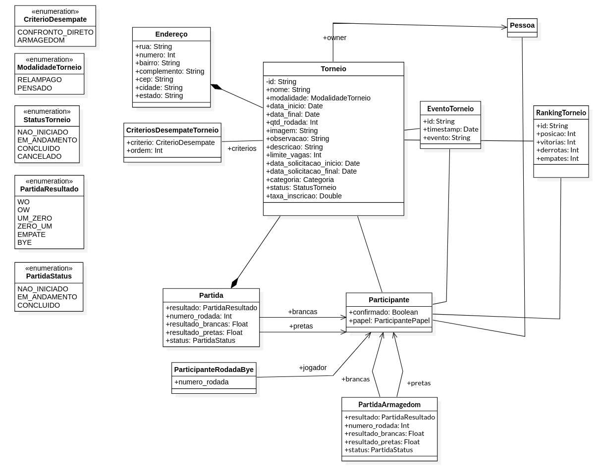

# SeridoChess

Sistema de Gestão de Campeonados de Xadrez - O projeto Seridó Chess é um software de gerenciamento de torneios de xadrez desenvolvido na plataforma web e mobile que permite ao usuário Administrador cadastrar e gerenciar Torneios, Jogadores, e Organizadores. Além disso o sistema tem um sistema de Rating (método estatístico utilizado para se calcular a força relativa entre jogadores de xadrez), e os Árbitros que fizerem parte de cada torneio tem o poder de informar ao sistema os resultados de cada partida do Torneio.

## Modelagem

